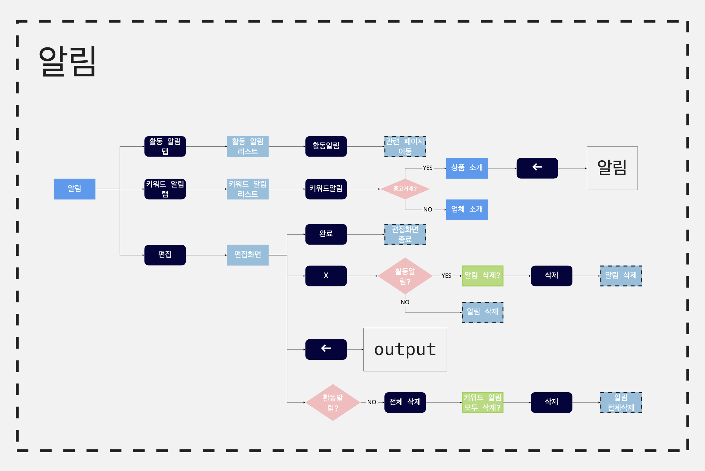
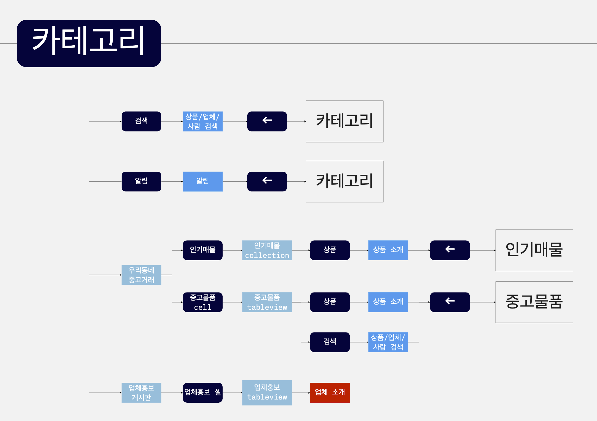
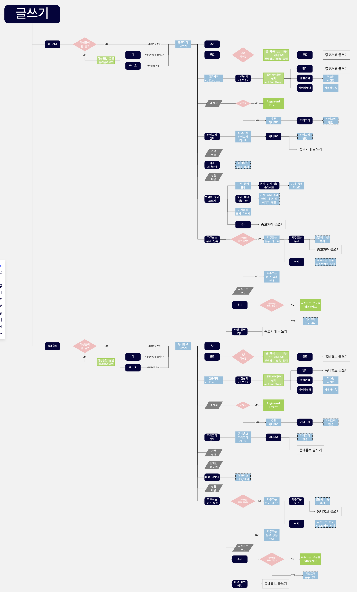

# Flow Chart

## Description

  

## Templeates

- 사용자가 판매중인 다른 상품 및 동네 인증 템플릿

  

- 활동 및 키워드 알림 템플릿

  

- 상품 소개 페이지 템플릿

  

- 로그인/가입, 내 동네 찾기, 검색 페이지 템플릿

  

## Flow

- 홈

  

- 카테고리

  

- 글쓰기

  

